# diagramium-player

[](https://www.npmjs.com/package/diagramium-player)
[](https://github.com/diagramium/diagramium-player/actions/workflows/ci.yml)
[](LICENSE)
[](https://www.npmjs.com/package/diagramium-player)

Play [Diagramium](https://www.diagramium.com) diagrams step by step in any web page — animated, with captions, and fully programmable from your own code.

- **Native files, no converter.** Plays the editor's saved `.json` (File → Save) and the public gallery's diagram files as they are.
- **Zero runtime dependencies.** Plain DOM, SVG, CSS and the Web Animations API — about 14 KB gzipped.
- **Isolated.** Mounts in a shadow root: your CSS can't break it, its CSS can't leak.
- **Programmable.** Chainable controls, step events, live node restyling, fonts and themes.
- **Private by design.** It makes no network requests of its own, sets no cookies, and collects nothing.

## How it works



<sub>This picture is itself a Diagramium diagram — drawn in the editor, exported as an animated SVG ([PNG](docs/how-it-works.png)), and saved as [`examples/how-it-works.json`](examples/how-it-works.json), which the player can play.</sub>

**1. Make it.** Draw your diagram in the [Diagramium editor](https://www.diagramium.com) (free, no account), add a short note to each step, then **File → Save**. You get one portable `.json` file.

**2. Load it.**

```js
import { DiagramiumPlayer } from 'diagramium-player';

const player = await DiagramiumPlayer.fromUrl('/how-it-works.json', {
  container: '#diagram',
  theme: 'glassmorphism',
});
```

**3. Control it from your code.**

```js
// look: 'glassmorphism', 'linear-midnight', 'bento-card' or your own tokens
player.setTheme('bento-card');

// type: family, size or scale — shapes resize to fit
player.setFont({ family: 'Georgia, serif', size: 16 });

// live data on any node: colours, glow, text, a status badge
player.updateNodeStyle('c3', { glow: '#22c55e', badge: { text: 'live' } });

// the story: goToStep, next, prev, play, pause — and events to sync your UI
player.goToStep(2).play();
player.on('step', (e) => console.log(e.index, e.note));
```

## Try it

Two live demos — nothing to install:

| | |
| --- | --- |
| **▶ [Player playground](https://diagramium.github.io/diagramium-player/)** | Pick an example, press Play, switch themes, fonts and sizes, restyle a node from code — or **drop your own Diagramium `.json`** on the player. |
| **▶ [Documentation, transformed](https://diagramium.github.io/diagramium-player/docs-sample/)** | The same docs page two ways — a static picture at the top vs the same diagram pinned above the text, building up as you read, with a guided tour. Two examples: [Getting started with Diagramium](https://diagramium.github.io/diagramium-player/docs-sample/diagramium-guide.html) ([before](https://diagramium.github.io/diagramium-player/docs-sample/diagramium-guide-static.html)) and a [checkout API guide](https://diagramium.github.io/diagramium-player/docs-sample/animated.html) ([before](https://diagramium.github.io/diagramium-player/docs-sample/static.html)). Reusable code: [`sync-docs.js`](docs-sample/sync-docs.js). |

Or run both locally:

```bash
git clone https://github.com/diagramium/diagramium-player.git
cd diagramium-player
npm install
npm run dev          # the playground at http://localhost:5173, the docs demo at /docs-sample/
```

[`examples/minimal.html`](examples/minimal.html) is the smallest page that plays a diagram — about ten lines to copy into your own site.

No diagram yet? Make one in the [Diagramium editor](https://www.diagramium.com) (free, no account) and save it with **File → Save**.

## Install

Published on npm as [**diagramium-player**](https://www.npmjs.com/package/diagramium-player):

```bash
npm install diagramium-player
```

It ships ES module and CommonJS builds with TypeScript types, and has no runtime dependencies.

```ts
import { DiagramiumPlayer } from 'diagramium-player';

const player = await DiagramiumPlayer.fromUrl('/diagrams/checkout.json', {
  container: '#diagram',
  theme: 'linear-midnight',          // 'bento-card' | 'glassmorphism' | { ...tokens }
});

player
  .on('step', (e) => highlightDocs(e.index, e.note))
  .play();

// live data
player.updateNodeStyle('n5', { text: 'Redis\n12 ms', stroke: '#22c55e', glow: true, badge: { text: 'healthy' } });
```

Or without a bundler, straight from a CDN (pin the version, so a later release can't change your page):

```html
<div id="diagram" style="height: 480px"></div>
<script type="module">
  import { DiagramiumPlayer } from 'https://cdn.jsdelivr.net/npm/diagramium-player@0.2.0/dist/index.js';
  DiagramiumPlayer.fromUrl('/my-diagram.json', { container: '#diagram', autoplay: true });
</script>
```

## Options

| Option | Default | |
| --- | --- | --- |
| `container` | — | Element or selector to mount into. |
| `source` | — | A parsed Diagramium document or its JSON text (use `fromUrl` for a URL). |
| `theme` | `'linear-midnight'` | A preset name or a (partial) token set. |
| `autoplay` | `false` | Start playing on mount. |
| `stepDuration` | `2600` | Milliseconds per step while playing. |
| `loop` | `false` | Start again after the last step. |
| `initialStep` | `0` | `-1` = empty stage, `'all'` = the finished diagram on its last step, `'overview'` = the finished diagram with no step highlighted. |
| `showCaption` | `true` | The built-in caption bar with each step's note. |
| `voice` | `false` | Read notes aloud with an on-device browser voice (silent if the browser has none). |
| `keyboard` | `true` | ← → step, Space play/pause, Home / End. |
| `reducedMotion` | `'auto'` | Follows `prefers-reduced-motion`; `'reduce'` / `'no-preference'` to force. |
| `font` | — | `{ family, size, weight, scale }` — see Fonts. |
| `padding` | `40` | Space around the diagram, in document units. |
| `ariaLabel` | the title | Accessible name for the diagram. |

## API

| Method | |
| --- | --- |
| `play()` / `pause()` / `toggle()` | Run or halt the step sequence. |
| `next()` / `prev()` | Move exactly one step (next animates in; prev is instant). |
| `goToStep(index)` | Seek instantly. `-1` empties the stage; values clamp. |
| `goToNode(nodeId)` | Seek to the step that reveals a node. |
| `showAll()` | The whole diagram with no step highlighted — the resting state for dashboards and reference pages. Any seek or `play()` leaves it; `isOverview` tells you whether it is on. |
| `updateNodeStyle(id, overrides)` | `text`, `fill`, `stroke`, `strokeWidth`, `strokeDasharray`, `textColor`, `glow`, `opacity`, `badge`, `fontSize`, `fontFamily`, `fontWeight`, `italic`. Persists across seeks. |
| `resetNodeStyle(id?)` | Drop overrides on one node, or all. |
| `updateEdgeStyle(id, overrides)` | Restyle a connector: `stroke` (the arrowhead follows), `width`, `glow`, `dashed`, `opacity`, `pulse` (keep the travelling pulse running). Persists across seeks. |
| `resetEdgeStyle(id?)` | Drop overrides on one connector, or all. |
| `getNodeRect(id)` | Where a shape is on screen (client coordinates) — for tooltips and menus. `null` if hidden. |
| `setTheme(presetOrTokens)` | Swap the look without re-rendering. |
| `setFont(font)` / `getFont()` | Set label type for the whole diagram (see below). `setFont(null)` returns to the document's own fonts. |
| `on(event, fn)` / `off(...)` | `ready`, `step`, `play`, `pause`, `end`, `error`, `nodeclick`, `nodehover`. `ready` and `step` are sticky: a late subscriber immediately gets the current state. Listening for `nodeclick` makes shapes focusable buttons (Enter / Space activate them); both shape events carry `{ nodeId, label, type, rect, originalEvent }`. |
| `destroy()` | Remove everything. |

Every method except `destroy` and `getFont` returns the player, so calls chain.

### Fonts

```js
new DiagramiumPlayer({ container, source, font: { family: 'Georgia, serif', size: 16 } });

player.setFont({ size: 18 });            // every label 18px; shapes grow to fit, like the editor
player.setFont({ scale: 1.25 });         // keep the document's sizes, 25% larger
player.setFont({ family: 'mono' });      // editor keys work: inter, serif, mono, slab, rounded, handwriting…
player.setFont({ size: null });          // back to each node's saved fontSize
player.setFont(null);                    // clear everything
```

`family` is a CSS font list or an editor font key; `size` and `weight` apply to every node (`null` = the document's own); `scale` multiplies whatever size wins. A node's own saved `fontFamily` still wins over `family`. The step you are on and any `updateNodeStyle` overrides survive the re-layout.

### Shapes and per-node styles

Nodes draw the way the editor draws them: icon boxes (service ⚙️, cache ⚡, queue 📨, database, gateway…) with their glyph, capped cylinders, clouds, diamonds, pills, containers (dashed, behind the arrows), the flowchart set (document, manual input, predefined process, off-page, delay, display) and UML actors. Saved per-node `fontSize`, `fontFamily`, `bold`, `italic`, `underline`, `textColor`, `fill` (a colour, `glass`, `gradient`, `none`), `color`, `borderColor`, `borderWidth`, `borderStyle`, `cornerRadius`, `opacity`, `align`, `w` and `h` are honoured. The icon table (`src/shapes.generated.ts`) is generated from the editor's shape catalogue by maintainers.

Keyboard (when focused): ← → step, Space play/pause, Home / End.

## Supported documents

Every **node-edge** diagram: flowchart, architecture, data flow, state machine, ER, UML class, C4, network, BPMN, process map, decision tree, concept map, swimlane, timeline, journey map, mind map (auto-laid-out) and more — about 90% of the Diagramium catalogue. Text-script documents (sequence diagrams, org charts, sitemaps) are rejected with a clear `DiagramiumFormatError` for now.

Step order follows the editor's contract: step *N* reveals the *N*th node (or the *N*th entry of the document's `order`), and a connector appears once both of its ends are on stage.

## Browser support

Current Chrome, Edge, Firefox and Safari (it uses shadow DOM, the Web Animations API and CSS `color-mix()`). Rendering needs a browser; `parseDiagram()` also runs in Node.

## Security and privacy

Diagram files are treated as untrusted input: text reaches the page only through `textContent`, never as HTML, and colours and font names are validated before use. The player sends nothing anywhere — `fromUrl` fetches only the URL you give it, without cookies. With `voice: true` it uses only voices the browser reports as on-device, so step notes are not sent to an online speech service.

Found a security problem? See [SECURITY.md](SECURITY.md).

## Contributing

Issues and pull requests are welcome — see [CONTRIBUTING.md](CONTRIBUTING.md).

## Develop

```bash
npm install
npm run dev        # demo page at http://localhost:5173 (index.html):
                   #   pick an example, or Open / drop any Diagramium .json
npm run typecheck
npm test           # builds, then runs the headless tests in tests/
npm run build      # dist/index.js (ESM), dist/index.cjs (CJS), dist/index.d.ts
```

## License

The code is [MIT](LICENSE) © 2026 DhuRee Labs Inc.

The example diagrams in `examples/` are not covered by the MIT licence — see [examples/README.md](examples/README.md).
